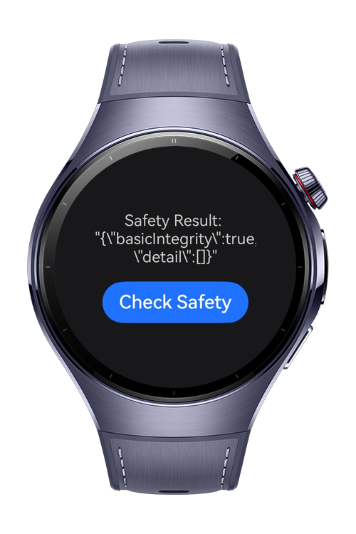
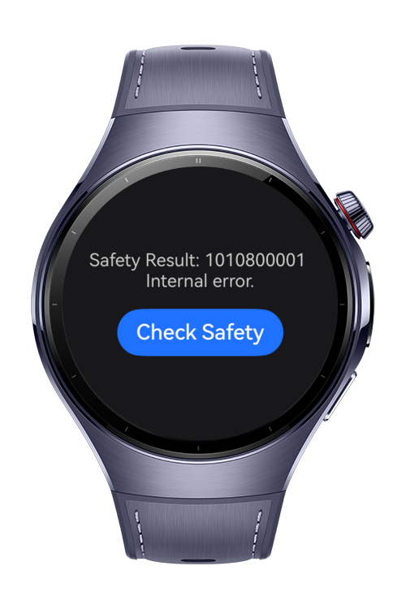

> **Note:** To access all shared projects, get information about environment setup, and view other guides, please visit [Explore-In-HMOS-Wearable Index](https://github.com/Explore-In-HMOS-Wearable/hmos-index).

# How to Perform a Local System Integrity Check with Device Security Kit?
This codelab demonstrates how to verify device security in HarmonyOS using the `checkSysIntegrityOnLocal` API of Device Security Kit.
System integrity checks help detect risks such as jailbroken or non-real devices. Based on the result, your app can decide how to proceed with its services.

# Preview

<div>


</div>

# Use Cases
- An app can call the checkSysIntegrityOnLocal API of Device Security Kit to perform a local system integrity check.

- Based on the result, the app can determine whether the device is secure (e.g., not jailbroken or a real device) and decide how to proceed with its services.

# Tech Stack
Languages: ArkTS (Ark TypeScript)

Frameworks: HarmonyOS SDK 5.1.0 (API Version 18)

Tools: DevEco Studio Version 5.1.0.842

Libraries & Kits:

- `@kit.DeviceSecurityKit` Provides APIs for performing local system integrity checks, allowing apps to determine whether the device environment is secure and make security-based decisions.

# Directory Structure
```
|---pages
|   |---Index.ets              # Entry point for routing and init logic
```

# Constraints and Restrictions

## Supported Devices

- Huawei Watch 5
- Devices running HarmonyOS 5.1.0 (API 18) and above

# Licence

DeviceSecurityKit is distributed under the terms of the MIT License
See the [LICENSE](./LICENSE) for more information.